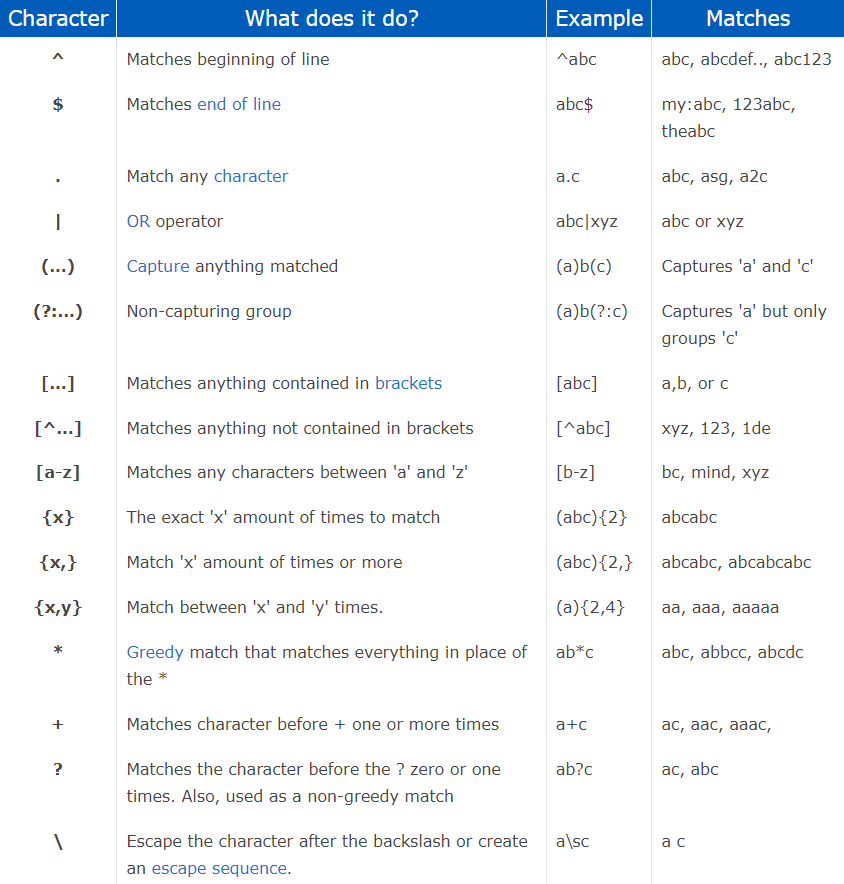
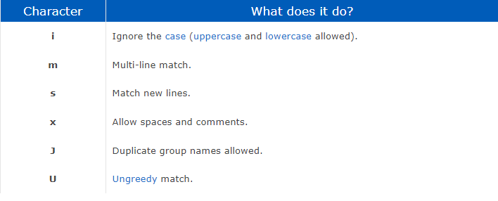
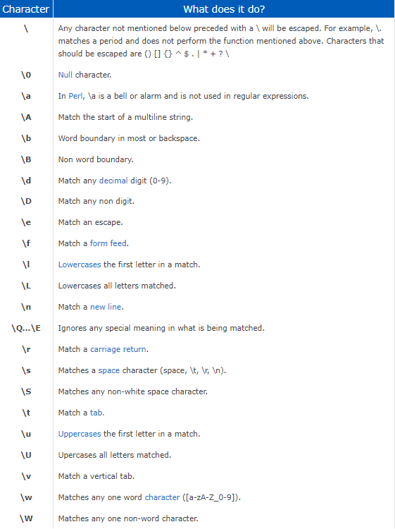

# RegEx Tutorial

RegEx/RegExp (Regular Expression) is a sequence of characters that specifies a match pattern in text. Match Pattern or pattern matching is when we check a given sequence of tokens for the presence of a pattern. The pattern has to be exact. In lay terms, RegEx is a string of text that lets you create patterns that help match, locate, and manage text. RegEx is used in many programming languages, command line, and text editors. This can save you thousands of hours in the future. 

## Summary

In this RegEx (Regular Expression) tutorial I will show how using RegEx will matching will work with emails.

Matching an email- /[\w._%+-]+@[\w.-]+\.[a-zA-Z]{2,4}/

Regular expression matches the email value by breaking the email into different sections with what you'd like to match.

## Table of Contents

- [Anchors](#anchors)
- [Quantifiers](#quantifiers)
- [OR Operator](#or-operator)
- [Character Classes](#character-classes)
- [Flags](#flags)
- [Grouping and Capturing](#grouping-and-capturing)
- [Bracket Expressions](#bracket-expressions)
- [Greedy and Lazy Match](#greedy-and-lazy-match)
- [Boundaries](#boundaries)
- [Back-references](#back-references)
- [Look-ahead and Look-behind](#look-ahead-and-look-behind)

## Regex Components

Here's a breakdown of RegEx characters

### Anchors

Anchors assert that the current position in the string matches a certain position. In the regular expression /[\w._%+-]+@[\w.-]+\.[a-zA-Z]{2,4}/
the [ ] says that we are matching anything inside the brackets.

### Quantifiers

We have different versions of quantifiers in the regular expression /[\w._%+-]+@[\w.-]+\.[a-zA-Z]{2,4}/

Inside the curly braces {} we have the quantifier 2 and 4 separated by a comma. This is interpreted as these must match at least 2 times, but no more than 4 times.

Our next quantifier in the regular expression /[\w._%+-]+@[\w.-]+\.[a-zA-Z]{2,4}/ is the + symbol, it says we will match characters before the + 1 or more times. If
we were to have a ? it limits the matching before the ? to 0 or 1 time.

### OR Operator

In this regular expression we do not have an OR operator |

If we were searching for specific email, such as /[\w._%+-]+@(GMAIL|HOTMAIL)+\.[a-zA-Z]{2,4}/ it would say: capture anything matching GMAIL or HOTMAIL

### Character Classes

In the regular expression /[\w._%+-]+@[\w.-]+\.[a-zA-Z]{2,4}/, the character classes are found inside the brackets []

In [\w._%+-] we are looking to match any character A-Z upper or lower case and any number 0 to 9 when using the \w, then we are looking to match the period, underscore,
percent, plus, and minus.

### Flags

In our regular expression we have not used any flags, but here is a reference

g (global): This flag allows a regular expression to match multiple occurrences of a pattern in a string, rather than just the first occurrence. For example, /abc/g would match all occurrences of "abc" in a string, rather than just the first occurrence.

i (ignore case): This flag makes the regular expression case-insensitive, meaning that it will match both uppercase and lowercase letters. For example, /abc/i would match "abc", "AbC", "ABC", and so on.

m (multiline): This flag changes the behavior of the ^ and $ anchors to match the beginning and end of each line in a multiline string, rather than just the beginning and end of the entire string.

### Grouping and Capturing

Capturing groups are a way to treat multiple characters as a single unit. By placing part of a regular expression inside round brackets or parentheses, you can group that part of the regular expression together. This allows you to apply a quantifier to the entire group or to restrict alternation to part of the regex. Only parentheses can be used for grouping. We don't use it in our expression.

### Bracket Expressions

In this part we will just look at one group of symbols in depth, the brackets. [ ] Brackets indicate a set of characters to match. Any individual character between the brackets will match, and you can also use a hyphen to define a set.

{ } Curly braces are used to specify an exact amount of things to match.

( ) Parentheses represent remembered matches. This is especially useful for find-and-replace operations or any time you need to do something with part of the match.

### Greedy and Lazy Match

In our regular expression we use the Greedy Match character + which brings back 1 or as many matches as possible. We do not use the Lazy Match Character ? which brings back 0 or 1 match

### Boundaries

In the above expression the boundaries are / 
This says that anything inside the forward slash is to be read as a regular expression.

### Back-references

We are using the back-reference \ to find a single period in this expression \.

A backreference in a regular expression identifies a previously matched group and looks for exactly the same text again.

### Look-ahead and Look-behind

Our expression does not use Look-ahead or Look-behind assertions. These are advanced features that allow you to match patterns only if they are followed by or preceded by certain other patterns.

## Author

My name is Ben Smyht and a I am a fullstack MERN developer student with Michigan State University's coding bootcamp. 

*smythbenb@gmail.com
*https://github.com/bsmyth310
